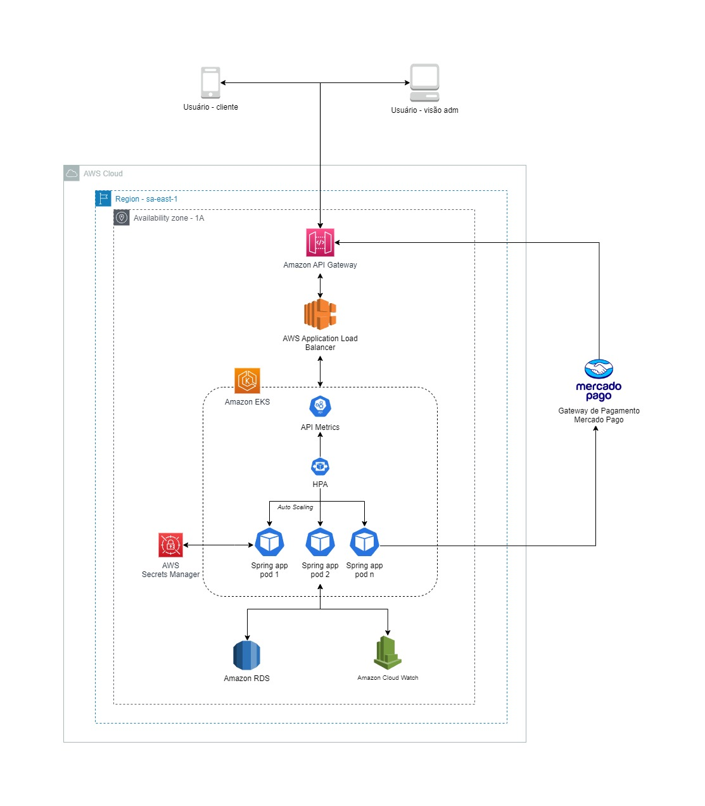

# FIAP Tech Challenge | Pós Tech

Projeto de Gestão de Pedidos para uma lanchonete desenvolvido para avaliação do curso de Pós-graduação em Arquitetura 
de Software da FIAP.

# Por onde começar

A stack definida para este projeto foi a seguinte:
- Java v17
- Postgres v16.0

O projeto está configurado para ser executado através de containers Docker. Para facilitar o processo de subir todo o 
ambiente necessário estamos utilizando o _docker compose_, então para subir a aplicação basta executar o seguinte comando: 

```sh
docker compose up -d
```

A primeira vez que o comando for executado pode demorar um pouco pois o docker precisa baixar as imagens utilizadas nos 
containers, mas feito isso a aplicação estará disponível em `localhost:8080/api` 

# Documentação com Swagger

A documentação dos endpoints da API pode ser consultada através da seguinte url: `localhost:8080/api/swagger-ui/index.html`

# Estrutura do Projeto

Com o intuito de tornar a separação de responsabilidades um pouco mais "óbvia" o projeto foi subdividido em três módulos 
principais: **api**, **application** e **database**. O _módulo api_ é o responsável por inicializar todo o projeto, é 
aquele que contém a classe "Main" carregada pelo Spring, 
e tem como objetivo prover a interface de entrada/saída para os consumidores da API. O _módulo database_, como o nome 
sugere, está responsável pela interação com banco de dados e nesse módulo estão todas as classes responsáveis por 
efetuar as operações de CRUD. Por fim
_o módulo application_ é onde estão implementadas as características do negócio, nesse caso, tudo o que descreve a 
lanchonete usada no desafio.

# Desenho da arquitetura

* ### Requisitos do negócio:
    Os requisitos do negócio (problema) podem ser acessados através deste [link](https://miro.com/app/board/uXjVMomeqoU=/). Nele contém um conjunto de 
* artefatos que detalham o negócio, utilizando-se de práticas do DDD.

* ### Requisitos de infraestrutura:
    Abaixo é possível visualizar o desenho de solução da aplicação, que detalha em nível de infraestrutura a abordagem 
* utilizada, tal como decisões arquiteturais e serviços utilizados para atender o problema mencionado acima. 
    
  

# Como executar

Para executar chamadas aos endpoints da aplicação, é necessário que se tenha o aplicativo postman instalado. A 
collection do postman com as respectivas requisições pode ser encontrada 
no caminho `collection/Tech Challeng.postman_collection.json`. Também se faz necessário possuir o arquivo com as 
variáveis `collection/Tech Challeng - Test.postman_environment.json`. Após baixar os dois arquivos, basta importá-los 
ao postman.

Após importada a collection e o environment, ao clicar com o botão direito na collection importada, posteriormente 
clicando em `"Run collection"`, é possível executar todas as requisições de chamadas à aplicação de forma encadeada. 
Desta forma, é exibida uma visualização de testes automatizados do postman, que mostra o resultado de cada uma das 
execuções, comparando-os com os respectivos resultados esperados.

# Cluster Kubernetes

>Para testar/validar os itens descritos a seguir é pré-requisito ter acesso a um cluster Kubernetes.

O diretório k8s contém os arquivos de manifesto necessários para executar a aplicação em um cluster Kubernetes e foram
separados da seguinte forma:
  - **database_conf.yaml**: Arquivo de _Secrets_ e _ConfigMaps_ para gerar credenciais e configurações do banco de dados;
  - **database.yaml**: Arquivo com _Deployment_ e _Service_ para o banco de dados da aplicação;
  - **backend_api.yaml**: Arquivo com todas as configurações necessárias para subir a API em um cluster k8s
    * Deployment
    * HPA
    * Service

## Subindo os recursos

Para fins de comodidade e facilidade na execução do projeto em um cluster local, optamos por executar o banco de dados
dentro do cluster. Então o primeiro passo para a criação dos recursos no Kubernetes é abrir o arquivo _database_conf.yaml_,
editar os valores dos Secrets definidos e executar o comando `kubectl apply -f database_conf.yaml`. Feito isso podemos
prosseguir e a realizar o deployment do banco de dados aplicando as definições do arquivo `database.yaml`. Após essas
etapas teremos os seguintes recursos adicionados ao cluster:
- ConfigMap _db-config_ para guardar a URL do banco de dados;
- Secret _db-secret_ para armazenar as credenciais de acesso ao banco de dados;
- Deployment _postgres-dep_ responsável por executar o _pod_ onde estará o banco de dados;
- Service _postgres-svc_ serviço, do tipo ClusterIP, para permitir que a aplicação acesse o banco de dados.

Agora temos os recursos necessários para subir a aplicação backend dentro do cluster e para isso basta executar 
`kubectl apply -f backend_api.yaml`. Tudo correndo como o esperado ao final da execução do comando teremos nosso backend
sendo executado no cluster e os seguintes recursos adicionados:

- Deployment _backendapi-dep_ com os detalhes para criação dos pods da aplicação;
- HPA _backendapi-hpa_ definição das métricas para escalabilidde da aplicação;
- Service _backendapi-svc_ serviço, do tipo NodePort, para permitir acesso externo a aplicação.

## Executando a aplicação

Com o cluster de pé podemos testar a amplicação direcionando as requesições para a porta do serviço criado para permitir
o acesso em `http://localhost:30808/api`. Caso vc tenha alterado o arquivo de manifesto para expor o serviço em uma
porta diferente ajuste a url de acordo.